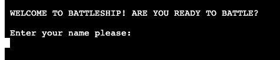
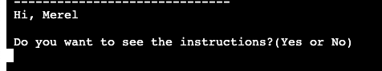
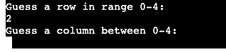
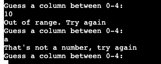
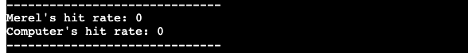
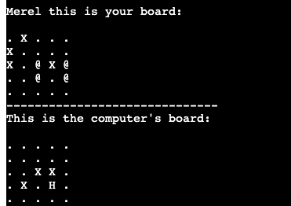
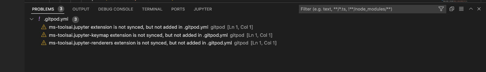

#LET'S PLAY BATTLESHIP

Welcome,

In this document I will explain the approach and instructions for the BattleShip game. The purpose of this project is let the user enjoy an online game called Battleship. The goal of the game is to defeat the computer sinking his ships. Though, the player must be quick because otherwise the bank may sink all of the player's ship. 

The last update to this file was: **October 11, 2022**

## Deployed project
The game can be played via the following link: https://battleship-mm.herokuapp.com/

## User Stories
**User stories**
The user stories that are at the base of this website are as follows:

* As a user I want to play the online version of Battleship
* As a user I want to understand how this game works

## Instructions and features
This is an online version of the Battleship game. For who is unfamiliar with the game, please read more about if via the following link: https://en.wikipedia.org/wiki/Battleship_(game)

In this version the player is asked to enter his or her name to personalize the game.
After the player inserts his name, the player is asked whether or not he wants to see the instructions.
If yes, the user is asked to insert 'start' when ready to play.

Two random boards are generated for both the player and the computer. The locations of the player's ships are shown by a '@'.
The location of the computer's ship are hidden.
The locations of the ships are randomly generated for both the user and computer. The system validates whether a coordinate exists already to ensure 4 unique coordinates are generated.

The player is asked to guess a row, and hence guess a column. If the input is not valid, the user gets feedback and can try again.
A hit is displayed by an 'H' and a miss is displayed by a 'X'.
The computer's guesses are randomly generated, and validated. If a computer's guess has been made before it will generate a new one.

The player wins if the sinks the 4 ships of the computer before the computer sinks the player's 4 ships. 

After the player wins or loses, he can choose to reset the game.

**Features**

* Username input: the player is asked to insert his/her name.

* Instructions input: the player can choose to read the instructions, or not.

* Guess input: the user can insert his guess for a row and column.

* Input validation: the player gets feedback when the input is not valid. The validation checks for range(0-4), type(number), and if the guess has already been made before.

* Score board: to give the player a quick overview of the scores instead of counting the H's, a score board is displayed with the hit rate of both player and computer.

* Boards: both the player's board and the computer's board are displayed. An 'H" represents a HIT, an X represents a MISS. The location of the player's ships are represented by an @. The computer's ships are hidden.

* Result: after 4 ships are sunk by either the player or the computer, the game will display a result message.

**Future Features**
The following features would be nice to add in the future:

* Letting the player decide the size of the grid
* Letting the player decide the number of ships
* Being able to add ships that are larger than one dot on the grid

## Data model
In this project I use a GamePlayer class model. There are two instances of the GamePlayer class model: the Player and the Computer GamePlayer 

The GamePlayer class model stores the type of the player (player or computer), number of ships, the guesses that are made, and the ship locations.

The class also includes several methods:
* The print method: this method prints the board. The code for this method is based on the Code Institute scope model project.
* The add ship method: this methods adds a ship to the board by taking the random generated coordinates as parameters.
* The guess_handling method: this method checks whether the guess results in a HIT or in a MISS, and calls the keep_score function in case of a HIT.

## Testing
**Validators**
PEP8 was installed via the following steps:
* I ran the command pip3 install pycodestyle.
* In my workspace, I pressed Cmd+Shift+P on Mac.
* I typed the word linter into the search bar, and clicked on Python: Select Linter.
* I selected pycodestyle from the list.
No errors were red underlined and no errors were shown in the PROBLEM tab besides:

**Testing the User Stories from User Experience (UX) section**
* As a user I want to play the online version of Battleship: the user can play the online version of this Battleship game via Heroku. The user is able to make a guess for a row and a column to try and hit one of the computer's ships. If the user sinks four of the computer's ships before the computer sinks all of his ships, the user wins.
* As a user I want to understand how this game works: the user can choose to see the instructions of the game when the game starts. Step by step the user is asked to make a guess. If the user input is not valid, the user receives feedback why it is invalid, and the user can try again.

**Bugs found and solved**
* Break while True loop input guess:
     * Test: insert a number above 4
     * Bug: while True loop did not continue after the user inserted a number outside of the scope. 
     * Fix: fixed by adding a return value and using that to break the while loop.
* Break while True loop of start_game:
     * Test: played game until there was a winner
     * Bug: game kept running even though there was a winner.
     * Fix: using the return value in an if statement and letting the loop break after the return was False.
* Reset game input not accepted:
     * Test: inserted a 'Yes' as input for the reset question
     * Bug: 'Yes', did not lead to a reset
     * Fix: used a try and except statement instead of an if statement.
* System clear: 
     * Test: ran the game
     * Bug: you could not see whether the player had a hit or miss anymore
     * Fix: By putting it before the guess_handling it now shows the result of the player's guess.
* Input validation name:
     * Test: input nothing and a number as a name
     * Bug: user could leave name empty or enter digit
     * Fix: adding try/except statement.

**Unsolved bugs**
As far as I could find there are no outstanding bugs.

## Deployment
**Heroku**
The project was deployed to Heroku using the following steps:
1. I pushed my final code via the terminal after finishing the project.
2. I created a new Heroku app
3. I set the build backs to 'Python' and 'NodeJS' in that order
4. I linked the Heroku app to the repository
5. Then I selected 'deploy'

**Creating a local clone**
You can create a local clone of the repository via the following steps:
1. navigate to the main page of the repository
2. download the code
3. Copy the URL for the repository.
4. Open Terminal
5. Change the current working directory to the location where you want the cloned directory.
6. Type git clone, and then paste the URL you copied earlier.
7. Press Enter to create your local clone.

For more detailed instructions, navigate to the following page:
https://docs.github.com/en/repositories/creating-and-managing-repositories/cloning-a-repository

## Credits
**Code**
* The structure of the class is based on the Code Institute scope example
* The code for the printing of the board is the Code Institute scope example

**Acknowledgements**
* I want to thank the tutors for guiding me 
* I thank my mentor for his review and feedback on my project
* I thank my fellow students for providing me with suggestions via Slack
* I want to Code Institute for the modules that made me capable of writing this code
---

Thank you!